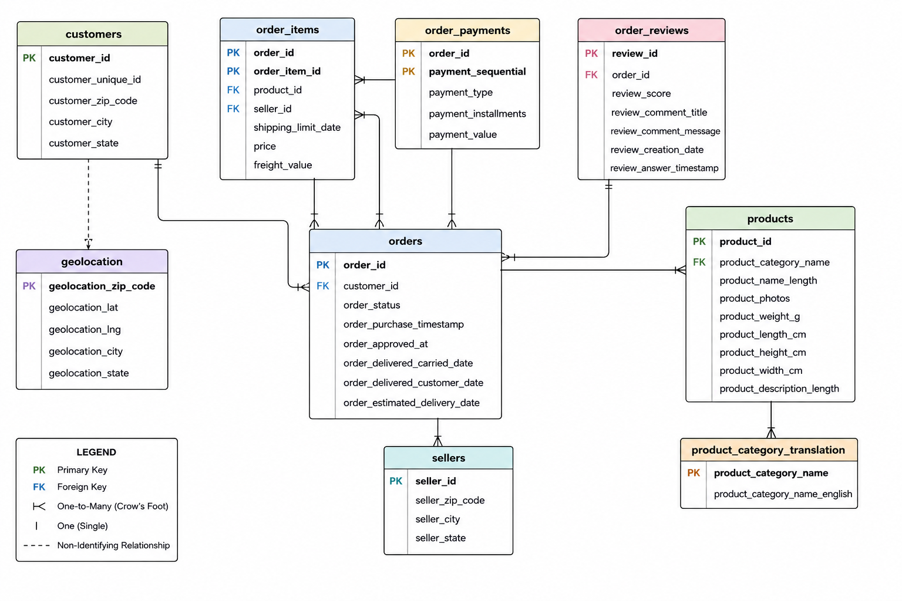

# Database Schema

## Overview

This project uses the **Olist Brazilian E-Commerce dataset**, a relational dataset containing customer, order, product, payment, review, seller, and geographic information.

The database is structured around the relationship between **customers, orders, and order items**, with additional tables providing information about payments, reviews, products, sellers, product categories, and geographic locations.

The schema was designed to support customer retention, purchasing behavior, and revenue analysis using SQL.

## Entity Relationship Diagram



## Tables

### `customers`

Contains customer information associated with orders.

**Primary Key:** `customer_id`

| Column               | Description                                                                     |
| -------------------- | ------------------------------------------------------------------------------- |
| `customer_id`        | Unique identifier for a customer record associated with an order                |
| `customer_unique_id` | Persistent identifier used to identify the same customer across multiple orders |
| `customer_zip_code`  | Customer ZIP-code prefix                                                        |
| `customer_city`      | Customer city                                                                   |
| `customer_state`     | Customer state                                                                  |

`customer_unique_id` is particularly important for this project because it allows repeat customers to be identified across multiple orders.

---

### `orders`

Contains one record for each order.

**Primary Key:** `order_id`

**Foreign Key:** `customer_id` → `customers.customer_id`

| Column                          | Description                                       |
| ------------------------------- | ------------------------------------------------- |
| `order_id`                      | Unique identifier for an order                    |
| `customer_id`                   | Identifies the customer associated with the order |
| `order_status`                  | Current status of the order                       |
| `order_purchase_timestamp`      | Date and time the order was placed                |
| `order_approved_at`             | Date and time the order was approved              |
| `order_delivered_carried_date`  | Date the order was handed to the carrier          |
| `order_delivered_customer_date` | Date the order was delivered to the customer      |
| `order_estimated_delivery_date` | Estimated delivery date                           |

This is the central transaction table and connects customer activity to orders, payments, reviews, and order items.

---

### `order_items`

Contains the individual products included within each order.

**Primary Key:** (`order_id`, `order_item_id`)

**Foreign Keys:**

* `order_id` → `orders.order_id`
* `product_id` → `products.product_id`
* `seller_id` → `sellers.seller_id`

| Column                | Description                                       |
| --------------------- | ------------------------------------------------- |
| `order_id`            | Identifies the order                              |
| `order_item_id`       | Sequential identifier for an item within an order |
| `product_id`          | Identifies the product purchased                  |
| `seller_id`           | Identifies the seller fulfilling the item         |
| `shipping_limit_date` | Seller shipping deadline                          |
| `price`               | Price of the item                                 |
| `freight_value`       | Freight/shipping cost                             |

An order can contain multiple items, so `order_items` has a **one-to-many relationship** with `orders`.

This table is used to calculate product-level and order-level revenue.

---

### `products`

Contains information about products sold through the marketplace.

**Primary Key:** `product_id`

**Foreign Key:** `product_category_name` → `product_category_translation.product_category_name`

| Column                       | Description                       |
| ---------------------------- | --------------------------------- |
| `product_id`                 | Unique product identifier         |
| `product_category_name`      | Original product category         |
| `product_name_length`        | Length of the product name        |
| `product_photos`             | Number of product photos          |
| `product_weight_g`           | Product weight in grams           |
| `product_length_cm`          | Product length                    |
| `product_height_cm`          | Product height                    |
| `product_width_cm`           | Product width                     |
| `product_description_length` | Length of the product description |

Products connect order items to product-level information and categories.

---

### `sellers`

Contains information about sellers participating in the marketplace.

**Primary Key:** `seller_id`

| Column            | Description              |
| ----------------- | ------------------------ |
| `seller_id`       | Unique seller identifier |
| `seller_zip_code` | Seller ZIP-code prefix   |
| `seller_city`     | Seller city              |
| `seller_state`    | Seller state             |

Sellers have a **one-to-many relationship** with `order_items` because a seller can fulfill items across many orders.

---

### `order_payments`

Contains payment information associated with orders.

**Primary Key:** (`order_id`, `payment_sequential`)

**Foreign Key:** `order_id` → `orders.order_id`

| Column                 | Description                                           |
| ---------------------- | ----------------------------------------------------- |
| `order_id`             | Identifies the order                                  |
| `payment_sequential`   | Sequence number for payments associated with an order |
| `payment_type`         | Payment method                                        |
| `payment_installments` | Number of payment installments                        |
| `payment_value`        | Payment amount                                        |

An order can contain multiple payment records. This is important when calculating revenue because joining orders directly to payment records can duplicate order-level data.

---

### `order_reviews`

Contains customer reviews associated with orders.

**Primary Key:** `review_id`

**Foreign Key:** `order_id` → `orders.order_id`

| Column                    | Description                           |
| ------------------------- | ------------------------------------- |
| `review_id`               | Unique review identifier              |
| `order_id`                | Identifies the reviewed order         |
| `review_score`            | Customer review score                 |
| `review_comment_title`    | Review title                          |
| `review_comment_message`  | Review text                           |
| `review_creation_date`    | Date the review was created           |
| `review_answer_timestamp` | Date and time the review was answered |

Review data can be used to investigate whether customer experience is associated with repeat purchasing.

---

### `product_category_translation`

Provides English translations for the original Portuguese product categories.

**Primary Key:** `product_category_name`

| Column                          | Description                         |
| ------------------------------- | ----------------------------------- |
| `product_category_name`         | Original product category           |
| `product_category_name_english` | English translation of the category |

This table is primarily used to make product-category analysis easier to interpret.

---

### `geolocation`

Contains geographic coordinates and location information associated with ZIP-code prefixes.

| Column                 | Description     |
| ---------------------- | --------------- |
| `geolocation_zip_code` | ZIP-code prefix |
| `geolocation_lat`      | Latitude        |
| `geolocation_lng`      | Longitude       |
| `geolocation_city`     | City            |
| `geolocation_state`    | State           |

The geolocation table is treated as a **supplementary reference dataset rather than a formal foreign-key relationship**.

ZIP-code prefixes can be used during analysis to associate geographic information with customers or sellers. However, they are not treated as unique identifiers for individual geographic records.

## Relationships

The main relationships in the database are:

```text
customers
    │
    │ 1 : many
    ▼
orders
    │
    ├──────────────► order_payments
    │                 1 : many
    │
    ├──────────────► order_reviews
    │                 1 : many
    │
    └──────────────► order_items
                      1 : many
                       │
                       ├──────────► products
                       │             many : 1
                       │
                       └──────────► sellers
                                     many : 1
```

Products can additionally be associated with:

```text
products
    │
    │ many : 1
    ▼
product_category_translation
```

Geolocation is kept separate as a supplementary lookup/reference table.

## Analytical Importance

The schema supports the project's main analytical questions:

* **Customer retention:** `customers` → `orders`
* **Repeat purchasing:** `customer_unique_id` → multiple `orders`
* **Revenue analysis:** `orders` → `order_items`
* **Product/category analysis:** `order_items` → `products`
* **Payment analysis:** `orders` → `order_payments`
* **Customer experience:** `orders` → `order_reviews`
* **Seller analysis:** `order_items` → `sellers`
* **Geographic analysis:** customer/seller ZIP-code prefixes → `geolocation`

The core analytical path for the retention investigation is:

```text
Customer
   ↓
Orders
   ↓
Order Items
   ↓
Products
```

with payments and reviews providing additional context:

```text
                    ┌──► Order Payments
                    │
Customers ──► Orders ──► Order Items ──► Products
                    │          │
                    │          └────────► Sellers
                    │
                    └──► Order Reviews
```

## Important Data-Model Considerations

Several tables operate at different levels of detail, or **grain**.

For example:

* `customers` contains customer-level records.
* `orders` contains order-level records.
* `order_items` contains item-level records.
* `order_payments` can contain multiple records per order.
* `order_reviews` contains review-level records.

Because of these differences in grain, joins must be handled carefully to avoid unintentionally duplicating records and inflating metrics such as revenue or order counts.

This is particularly important when joining `orders` with both `order_items` and `order_payments`.

For customer retention analysis, `customer_unique_id` is used to identify customers across their purchasing history rather than treating every `customer_id` as a separate long-term customer.
